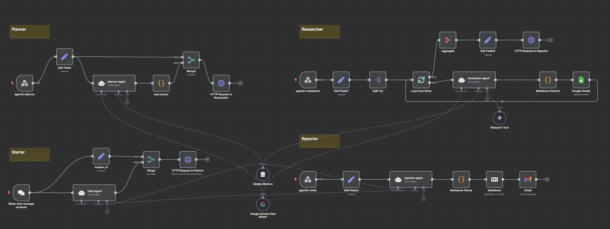

# n8n 自動化工作流：多代理人研究 Agent (Agentic-Research)

此 n8n 工作流程利用多個協作的 AI 代理人（Agent）來執行一個完整的研究任務。從接收使用者查詢開始，逐步進行提示詞優化、研究主題規劃、子主題深入研究，最終彙整成一份詳細報告並透過 Email 發送。

此 Agentic Research Agent的特色在於透過Webhook串聯AI Agent，並讓所有Agent的輸入/輸出都存放在相同的memory，提高整體協作效率與準確。

## 重要資源

*   [工作流程文件](./Agentic_Research.json)
*   [Research Tool MCP Client](./Researcb_Tool_MCP_Trigger.json)
*   [Google Sheet template](https://docs.google.com/spreadsheets/d/16mxJd9X8MKEZiHs2aWbOopi0pybT53SWaXqSQrt3yWQ/edit?usp=sharing) (用於儲存研究過程中的資料)
!

## 工作流程概覽

本工作流程採用多代理人架構，主要分為以下幾個階段：

1.  **起始代理人 (Starter Agent):**
    *   透過 **聊天觸發 (Chat Trigger)** 接收使用者輸入 (`chatInput`)。【此處以n8n內建聊天觸發器為例，可自由替換包含Line、Telegram等觸發節點】
    *   使用 **Google Gemini AI Agent (`start-agent`)** 優化使用者輸入的提示詞，使其更適合 LLM 理解。
    *   將優化後的提示詞透過 **HTTP Request (`HTTP Request to Planner`)** 發送給規劃代理人。
    *   使用 **簡單記憶體 (Simple Memory)** 節點來記錄對話歷史。

2.  **規劃代理人 (Planner Agent):**
    *   透過 **Webhook (`agentic-planner`)** 接收來自起始代理人的請求。
    *   使用 **Google Gemini AI Agent (`planner-agent`)** 將優化後的提示詞分解為 3-5 個具體、相關且深入的研究子主題。
    *   將生成的子主題列表 (JSON 格式) 透過 **HTTP Request (`HTTP Request to Researcher`)** 發送給研究代理人。

3.  **研究代理人 (Researcher Agent):**
    *   透過 **Webhook (`agentic-researcher`)** 接收來自規劃代理人的子主題列表。
    *   使用 **Split Out** 和 **Loop Over Items** 節點遍歷每個子主題。
    *   **迴圈處理每個子主題:**
        *   使用 **Google Gemini AI Agent (`researcher-agent`)** 結合 **MCP 研究工具 (`Research Tool`)** 進行外部資料搜尋。
            *   輸入：單個研究子主題。
            *   任務：產生關鍵字、執行外部搜尋、根據搜尋結果撰寫 Markdown 格式的子報告。
            *   輸出：針對該子主題的 Markdown 研究報告。
        *   使用 **Code 節點 (`Markdown Parser3`)** 清理 AI 輸出的 Markdown 格式。
        *   將每個子主題的研究結果（包含 sessionId, topic, research\_output）寫入 **Google Sheets (`Google Sheets`)** 的 `research_output` 工作表。
    *   使用 **Aggregate** 節點彙整所有子主題的研究結果。
    *   將彙整後的結果透過 **HTTP Request (`HTTP Request to Reporter`)** 發送給報告代理人。

4.  **報告代理人 (Reporter Agent):**
    *   透過 **Webhook (`agentic-writer`)** 接收來自研究代理人的彙整結果。
    *   使用 **Google Gemini AI Agent (`reporter-agent`)** 整合所有子主題報告。
        *   輸入：原始使用者問題（隱含於對話歷史或傳遞的 sessionID）和所有子主題的研究報告。
        *   任務：基於所有子報告內容，撰寫一份結構完整、內容詳實、直接回應原始問題的最終 Markdown 報告。
        *   輸出：最終的 Markdown 報告。
    *   使用 **Code 節點 (`Markdown Parser`)** 清理 AI 輸出的 Markdown 格式。
    *   使用 **Markdown 節點** 將最終報告轉換為 HTML 格式。
    *   透過 **Gmail 節點** 將 HTML 格式的最終報告發送給指定收件人。

## 前置需求

*   **n8n 環境:** 建議使用自架 n8n 環境。
*   **API 憑證:**
    *   **Google Gemini API:** 需要擁有 Google Cloud Platform 帳號並啟用 API，取得 API 金鑰。用於驅動所有 AI Agent。
    *   **Google Sheets API:** 需要啟用 Google Sheets API 並取得 OAuth2 憑證，用於儲存研究結果。
    *   **Gmail API:** 需要啟用 Gmail API 並取得 OAuth2 憑證，用於發送最終報告。
*   **MCP 研究工具:**
    *   需要一個正在運行的 MCP (Model Context Protocol) 伺服器，提供研究工具。
    *   工作流程中的 `Research Tool` 節點需要配置正確的 SSE 端點 (在此範例中為 `http://host.docker.internal:5678/mcp/research-tool/sse`)。確保 n8n 可以訪問此端點。
*   **Google Sheets 設定:**
    *   需要建立一個 Google Sheet 文件 (在此範例中 ID 為 `1T8F5xHaEvzoTdJ8SwmPHntiOsMyLWPfMxRG_3XPe5pY`)。
    *   至少包含一個名為 `research_output` 的工作表，用於儲存研究代理人產生的子主題報告。欄位應包含 `sessionId`, `topic`, `research_output`。

## 如何使用

1.  **設定憑證:** 在 n8n 中設定好 Google Gemini, Google Sheets, Gmail 的 API 憑證。
2.  **設定 Google Sheets 節點:** 將工作流程中的 `Google Sheets` 節點的 `Document ID` 和 `Sheet Name` 更新為您自己的 Google Sheets 文件 ID 和工作表名稱/ID。
3.  **設定 MCP 研究工具節點:** 確保 `Research Tool` 節點中的 `sseEndpoint` 指向您正在運行的 MCP 研究工具伺服器端點，並且 n8n 可以訪問它。
4.  **設定 Gmail 節點:** 將 `Gmail` 節點的收件人 (`sendTo`) 更新為您希望接收最終報告的 Email 地址。
5.  **檢查 Webhook URL:** 確保 `HTTP Request to Planner`, `HTTP Request to Researcher`, `HTTP Request to Reporter` 節點中的 URL (`http://host.docker.internal:5678/webhook/...`) 中的主機名和端口對於您的 n8n 容器是正確的，可以訪問到對應的 Webhook 觸發器。
    *   若您使用 docker-compose，請確保 `docker-compose.yml` 中的網絡設置正確，並且所有服務都在同一網絡中運行。
    *   若您使用 n8n 的自架版本，請確保 Webhook URL 正確指向 n8n 的 Webhook 端點。例如將host.docker.internal替換成localhost或您的遠端主機ip或網址。

6.  **啟用工作流程:** 啟用此 n8n 工作流程。
7.  **觸發:** 透過 n8n 的聊天介面發送訊息給 `When chat message received` 觸發器，即可啟動研究流程。

工作流程執行完成後，一份詳細的研究報告將會根據您的查詢產生，並發送到您指定的 Email 地址。研究過程中的子主題報告會被記錄在指定的 Google Sheet 中。
