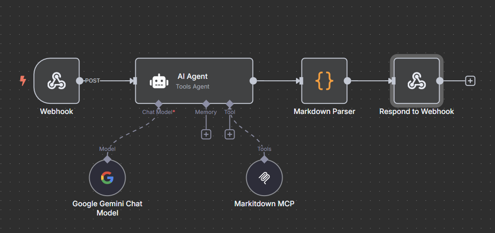
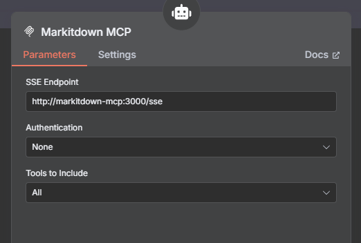

# 在n8n (docker部屬) 設定Markitdown MCP 設置指南

本文件提供如何設置 Markitdown MCP 服務的說明，包含在 n8n 工作流程中配置 SSE 端點的方法以及在 `docker-compose-example.yml` 文件中的相關設置。(使用前記得移除 -eaxmple)



## 1. 概述

Markitdown MCP 是一個用於將資源轉換為 Markdown 格式的服務，通過 n8n 工作流程與 AI Agent 集成，提供強大的內容處理能力。

## 2. 在 n8n 工作流程中設置 SSE 端點

在 n8n 工作流程中，Markitdown MCP 服務通過 SSE (Server-Sent Events) 端點與 AI Agent 進行通信。以下是設置步驟：

- **端點 URL**：在 n8n 工作流程的 `MCP markitdown` 節點中，SSE 端點設置為 `http://markitdown-mcp:3000/sse`。這表示 n8n 將通過此 URL 與 Markitdown MCP 服務進行通信。因於docker-compose.yml設置共用網路，因此可使用服務名稱(service name)進行連接。



## 3. 在 `docker-compose-example.yml` 中設置 Markitdown MCP

為了在 Docker 環境中運行 Markitdown MCP 服務，您需要在 `docker-compose-example.yml` 文件中進行以下配置：

- **服務定義**：在 `services` 部分，Markitdown MCP 服務定義如下：
  ```yaml
  markitdown-mcp:
    image: markitdown-mcp:latest
    container_name: markitdown-mcp
    networks: ['my-internal-network']
    restart: unless-stopped
    ports:
      - "3001:3000"
    volumes:
      - ./shared:/workdir
    command: ["--sse", "--host", "0.0.0.0", "--port", "3000"]
  ```
- **說明**：
  - **image**：使用 `markitdown-mcp:latest` 鏡像。
  - **container_name**：容器名稱設為 `markitdown-mcp`。
  - **networks**：加入 `my-internal-network` 網絡，以便與其他服務（如 n8n）通信。
  - **ports**：將主機的 3001 端口映射到容器的 3000 端口。請注意，n8n 工作流程中使用的端點是 `http://markitdown-mcp:3000/sse`，這是容器內部的端口。
  - **volumes**：將 `./shared` 目錄掛載到容器的 `/workdir`，允許服務訪問共享文件。(不僅是url，日後若想針對文件轉換至markitdown也可以)
  - **command**：啟動命令配置為啟用 SSE，監聽所有網絡接口（0.0.0.0）並使用 3000 端口。

## 4. 啟動服務

完成上述配置後，您可以使用以下命令啟動所有服務：

```bash
docker-compose up -d
```

這將啟動 Markitdown MCP 服務以及其他相關服務（如 n8n 和 PostgreSQL）。確保在啟動服務後，n8n 工作流程能夠正確連接到 Markitdown MCP 的 SSE 端點。

## 5. 故障排除

- 如果 n8n 無法連接到 Markitdown MCP 服務，請檢查 Docker 網絡設置，確保 `markitdown-mcp` 容器在 `my-internal-network` 網絡中運行。
- 確認端口映射正確無誤，主機端口 3001 應映射到容器端口 3000。
- 查看容器日誌以獲取更多錯誤信息：`docker logs markitdown-mcp`。

希望本指南能幫助您順利設置 Markitdown MCP 服務並與 n8n 工作流程集成。
