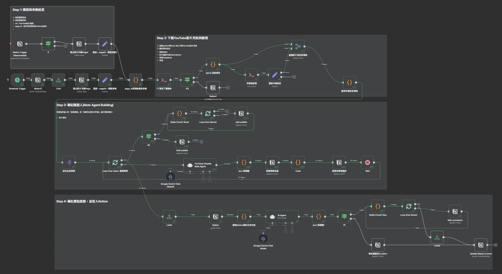

# n8n 自動化工作流 : YouTube-AI-Summary-to-Notion-Agent

此 n8n 工作流程旨在自動化從 YouTube 影片創建學習筆記並存儲到 Notion 的過程。它會提取影片資訊、字幕，並利用 AI 模型生成章節重點和整體摘要。



## 工作流程概覽

本工作流程主要分為以下幾個步驟：

1.  **觸發與參數設定 (Step 1):**
    *   可透過 **排程觸發 (Schedule Trigger)** 每 10 分鐘自動檢查 Notion 指定資料庫，或手動觸發 (原 Notion Trigger 已停用)。
    *   尋找 Notion 資料庫中 `source_type` 為 "YouTube" 且 `ai_summary` 狀態為 "Not Yet" 的頁面。
    *   限制每次處理一個項目 (Limit 節點)。
    *   從 Notion 頁面提取 YouTube 影片的 `url` 和 Notion 頁面的 `page_id`。
    *   建立一個新的 Notion 子頁面，用於存放完整的影片字幕。
    *   清理 `page_id` 中的連字號 (`-`)。

2.  **下載 YouTube 影片資訊與整理 (Step 2):**
    *   執行 `yt_json_download.py` Python 腳本，傳入 YouTube `url`。
    *   此腳本使用 `yt-dlp` 下載影片的標題、描述、章節 (chapters) 和字幕 (優先下載繁中、簡中、英文等字幕，若無則嘗試自動字幕)。
    *   檢查腳本是否成功執行並返回資訊。若失敗 (例如無法取得字幕)，則更新 Notion 頁面狀態為 "Can't get subtitle" 並停止。
    *   解析腳本輸出的 JSON，獲取影片資訊。
    *   執行 `vtt_to_json.py` Python 腳本，清理下載的字幕檔 (VTT) 並轉換為 JSON 格式。
    *   獲取清理後的字幕 JSON。
    *   將影片資訊 (含章節) 和字幕資訊合併。
    *   將每個章節的字幕內容整併到對應的章節資料中。

3.  **筆記機器人 - 章節重點生成 (Step 3):**
    *   將包含字幕的章節資料拆分成多個項目，每個項目代表一個章節。
    *   **迴圈處理每個章節 (Loop Over Items):**
        *   檢查字幕內容長度，如果超過 2000 字元，則進行分塊處理 (Splite ChunK Size2) 再寫入先前建立的字幕子頁面；否則直接寫入。
        *   使用 **Google Gemini AI Agent (YouTube Chapter Note Agent)**：
            *   輸入：章節標題和該章節的字幕內容。
            *   任務：扮演「章節重點摘要專家」，提取核心概念，以條列式生成重點筆記 (keynotes)，並自然融入學理關鍵字 (首次出現時加註英文)。
            *   輸出：包含章節標題和重點列表 (keynotes) 的 JSON。
        *   解析 AI Agent 輸出的 JSON。
        *   將章節標題寫入主要的 Notion 頁面 (作為 H2 標題)。
        *   將 AI 生成的每個重點 (points) 逐條寫入 Notion 頁面 (作為項目符號列表)。
        *   每個章節處理完畢後等待 1 秒。

4.  **筆記重點彙整與寫入 Notion (Step 4):**
    *   **讀取 Notion 頁面內容:** 待所有章節重點寫入完成後，讀取主要 Notion 頁面上的所有文字區塊內容。
    *   **合併內容:** 將讀取到的所有文字內容合併成單一文本字串 (`textData`)。
    *   **使用 Google Gemini AI Agent (AI Agent):**
        *   輸入：合併後的完整筆記文本內容 (`textData`)。
        *   任務：扮演「筆記摘要專家」，生成一份 500-800 字的高品質摘要 (Markdown 格式)，包含前言、重點、結論 (比例約 1:7:2)。
        *   輸出：Markdown 格式的摘要。
    *   **解析摘要輸出:** 清理 AI Agent 輸出的 Markdown 內容。
    *   **檢查摘要長度:** 如果摘要長度超過 1800 字元，則進行分塊 (Splite ChunK Size)，再逐塊寫入 Notion；否則直接寫入。
    *   **寫入最終摘要:** 在 Notion 主頁面新增 H1 標題 "重點筆記彙整"，並將 AI 生成的最終摘要 (或分塊後的摘要) 寫入其下。
    *   **更新狀態:** 將 Notion 主頁面的 `ai_summary` 狀態更新為 "Done"。

## 前置需求

**重要提示:** 以下說明主要基於在 **Docker 環境** 中運行 n8n 的情境。如果您是透過 npm 或其他方式安裝 n8n，部分環境設定步驟 (特別是 Docker 相關指令) 可能不適用或需要調整。

*   **n8n 環境:** : 適合自架n8n環境者。
*   **Python 環境:** n8n 的執行環境需要能夠執行 Python 腳本，並安裝必要的 Python 套件。
    *   `yt-dlp`: 用於下載 YouTube 資訊和字幕。
    *   `ffmpeg`: `yt-dlp` 可能需要 `ffmpeg` 來處理某些影音格式或合併下載。
*   **Docker 環境首次設定 (若適用):** 如果您在 Docker 容器中運行 n8n，首次設定容器時，需要在容器內執行以下指令來安裝 Python、pip、ffmpeg 並設定虛擬環境：
    *(如果您未使用 Docker，請確保您的 n8n 環境已安裝 Python 3, pip, ffmpeg，並可安裝 yt-dlp。)*
    ```bash
    # 以 root 使用者進入 n8n 容器
    docker exec -u root -it n8n sh

    # 更新套件列表並安裝 python3, pip, ffmpeg
    apk update
    apk add python3 py3-pip ffmpeg

    # 建立 Python 虛擬環境
    python3 -m venv /home/node/venv

    # 啟動虛擬環境
    source /home/node/venv/bin/activate

    # 在虛擬環境中安裝 yt-dlp
    pip install yt-dlp

    # 驗證 yt-dlp 是否安裝成功
    yt-dlp --version

    # 完成後可退出容器
    exit
    ```
*   **Python 腳本:**
    *   `yt_json_download.py`: 應放置於 n8n 可存取的路徑下 (例如，掛載的 volume 中的 `/python_script/` 目錄)。
    *   `vtt_to_json.py`: 同上，應放置於 `/python_script/` 目錄下。
    *   **路徑確認:** 確保 n8n 工作流程中 `Execute Command` 節點 (`YT資訊下載腳本`, `字幕檔清理`) 所使用的 Python 路徑 (`source /home/node/venv/bin/activate`) 和腳本路徑 (`/python_script/...`) 是正確且可訪問的。
*   **Notion API 憑證:** 需要建立 Notion API Integration 並取得 API 金鑰，然後在 n8n 中設定 Notion 憑證。
*   **Google Gemini API 憑證:** 需要擁有 Google Cloud Platform 帳號並啟用 Vertex AI API (Gemini 模型隸屬於此)，取得 API 金鑰，然後在 n8n 中設定 Google Gemini 憑證。
*   **Notion 資料庫:** 需要一個 Notion 資料庫，包含至少以下屬性：
    *   `source_type` (Select): 用於標記來源，需有 "YouTube" 選項。
    *   `ai_summary` (Select): 用於追蹤處理狀態，需有 "Not Yet"、"Done"、"Can't get subtitle" 選項。
    *   `url` (URL): 存放 YouTube 影片連結。
    *   (資料庫 ID 需要填入 Notion 節點中)

## 如何使用

1.  **設定憑證:** 在 n8n 中設定好 Notion 和 Google Gemini 的 API 憑證。
2.  **設定 Notion 節點:** 將工作流程中所有 Notion 節點的 `Database ID` 或 `Page ID` 更新為您自己的 Notion 資料庫/頁面 ID。特別注意觸發器和讀取/寫入資料庫的節點。
3.  **設定 Python 路徑:** 檢查 `Execute Command` 節點 (`YT資訊下載腳本`, `字幕檔清理`) 中的 Python 執行路徑和腳本路徑是否符合您的 n8n 環境配置。
4.  **啟用工作流程:** 啟用此 n8n 工作流程。
5.  **觸發:**
    *   **自動:** 工作流程預設每 10 分鐘檢查一次 Notion 資料庫。當您在指定的 Notion 資料庫中新增一筆資料，將 `source_type` 設為 "YouTube"，`ai_summary` 設為 "Not Yet"，並填入 `url`，工作流程會在下一個執行週期自動處理。
    *   **手動:** 您也可以手動執行此工作流程進行測試。

工作流程執行完成後，對應的 Notion 頁面將會包含由 AI 生成的章節重點和最終摘要筆記。
